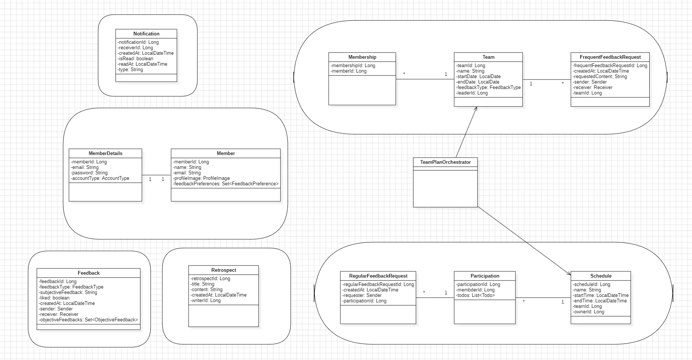
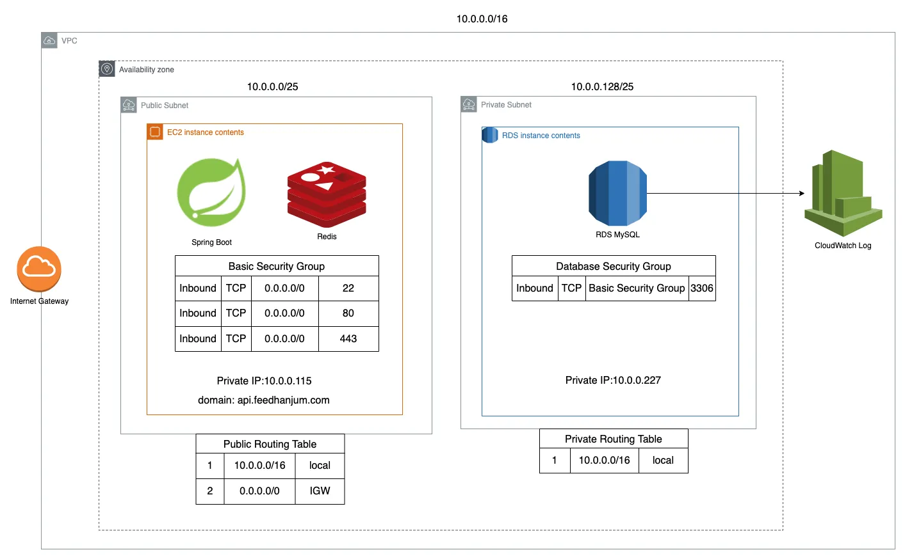
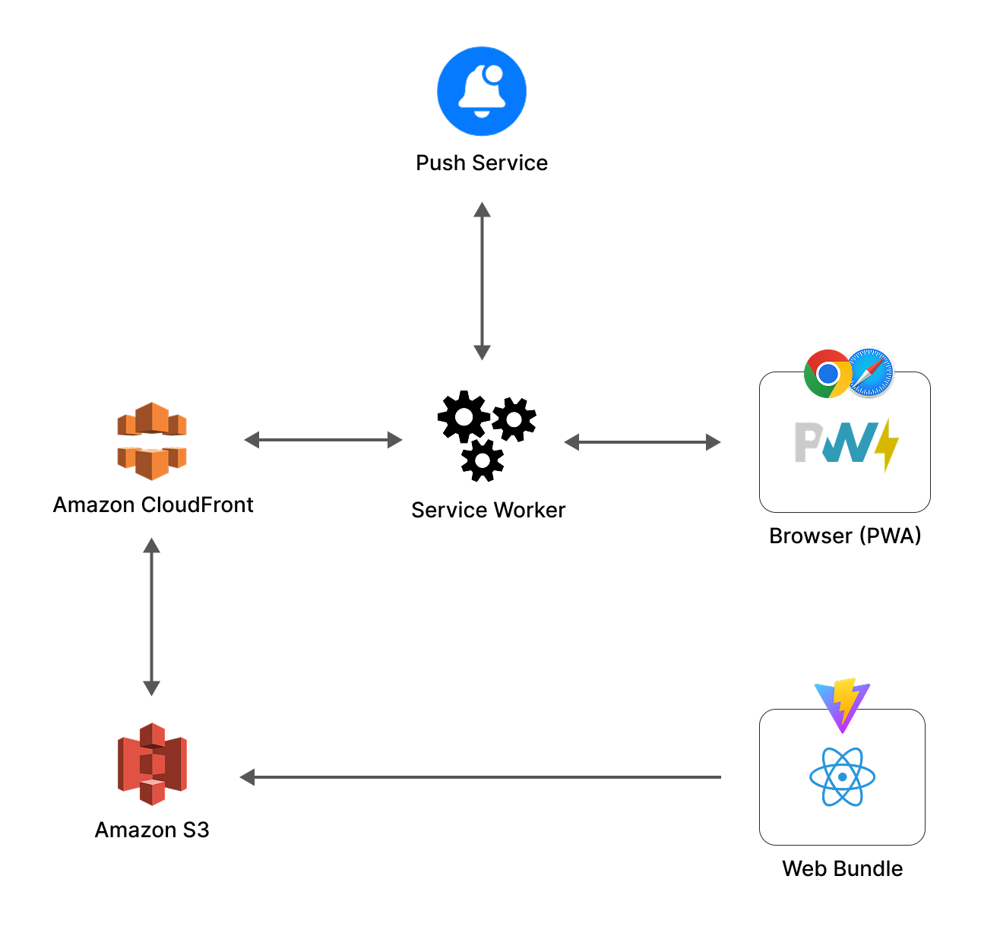
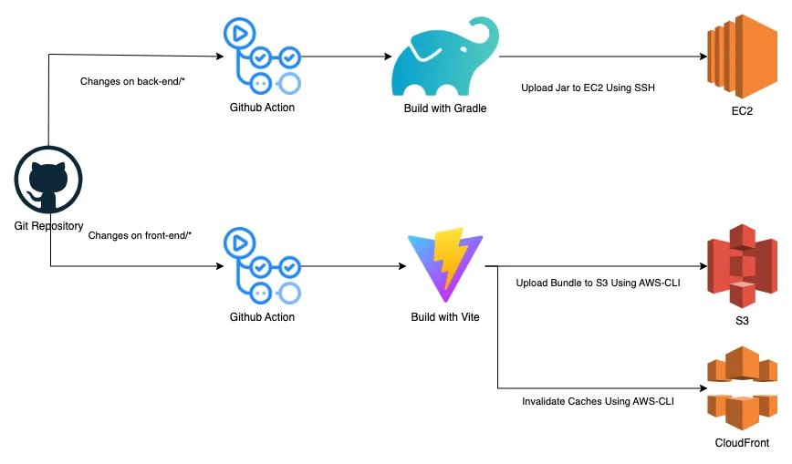

# 프로젝트 소개
피드백 주고 받기를 어려워하는 대학생들이 팀 프로젝트에서 건설적인 피드백을 작성하고 공유하는 과정을 도와주는 서비스입니다.

## 주요 기능
저희 <피드한줌>의 주요 기능은 **피드백 요청하기/보내기, 일정 관리, 피드백 리포트** 이며,  
이 외에도 **회원가입/로그인, 보낸/받은 피드백 조회, 회고 작성/조회, 팀 스페이스 관리, 피드백 선호도 설정** 등이 가능합니다.  
아래는 주요 기능의 시연 영상입니다.

<table>
<tr>
<td><b>피드백 보내기</b> <video src="https://github.com/user-attachments/assets/993102a0-bad2-40e1-9e85-b79e5b4b12d8" ></video>
<td><b>일정 추가</b> <video src="https://github.com/user-attachments/assets/ec202737-1815-41c5-aba3-3688374c839e" ></video>
<td><b>피드백 리포트를 포함한 마이페이지 기능</b> <video src="https://github.com/user-attachments/assets/42de714d-d610-44b3-a638-8e718f611981" ></video>
</table>

이외에 데모 화면들은 [여기](https://github.com/softeer5th/Team5-EQUUS-N/wiki/%EB%8D%B0%EB%AA%A8-%ED%99%94%EB%A9%B4)서 확인 가능합니다.

 

# 배포 URL
피드 한 줌: https://feedhanjum.com  
위 URL에 접속해 서비스 이용이 가능합니다.

 

# 팀원 소개

<table>
<tbody><tr>
    <td width="25%" align="center"><a href="https://github.com/GoGradually"><b>BE - 한준호</b></a></td>
    <td width="25%" align="center"><a href="https://github.com/vvsos1"><b>BE - 박명규</b></a></td>
    <td width="25%" align="center"><a href="https://github.com/lsj1137"><b>FE - 임세준</b></a></td>
    <td width="25%" align="center"><a href="https://github.com/hammsik"><b>FE - 백현식</b></a></td>
</tr>
<tr>
<td align="center"><a href="https://github.com/GoGradually"> </a> 
<td align="center"><a href="https://github.com/vvsos1"> </a> 
<td align="center"><a href="https://github.com/lsj1137"> </a> 
<td align="center"><a href="https://github.com/hammsik"> </a> 
</td>
</tr>
<tr>
    <td align="start">- 사용자 도메인 - 팀 도메인 - 일정 도메인 - AI 다듬기 </td>
    <td align="start">- 피드백 도메인 - 알림 도메인 - 구글 로그인 - CI/CD 구축</td>
    <td align="start">- 회원가입/로그인 페이지 - 일정 페이지 - 팀 스페이스 만들기 페이지 - 팀 스페이스 관리 페이지 - 받은 피드백 조회 페이지 - 보낸 피드백 조회 페이지 - 회고 조회 페이지 - 비밀번호 초기화 페이지 - PWA, 웹 푸시알림</td>
    <td align="start">- 메인 페이지 - 피드백 보내기 페이지 - 피드백 요청하기 페이지 - 마이페이지 - 프로필 수정 페이지 - 피드백 리포트 페이지 - API 모듈화 및 Mocking</td></tr>
</tbody>
</table>
 

<table>
</table>

 

# 브랜치 전략

- GitHub Flow 전략 사용
    - main: main, release 브랜치
    - dev: 프론트/백엔드 공유용
    - feature: JIRA 의 백로그에 따른 기능 브랜치
        - 기능 + 테스트 함께 개발
        - 기능개발 완료 혹은 퇴근 전에 dev 로 pull request 올리기
            - 본인 제외 아무나 1명이 merge 하기

 

# 기획 디자인 링크

https://www.figma.com/design/76hKNmM5L0ba1xrDnxbEwd/Handoff_EQUUS-N-(Copy)?node-id=1-6&p=f

 

# 도메인 모델

# 서비스 아키텍처

## 백엔드

 

## 프론트엔드

 

# CI/CD 워크플로우

 

# 기술 스택
## 공통

 

## 프론트엔드

 

## 백엔드

 

# [📚 프로젝트 위키](https://github.com/softeer5th/Team5-EQUUS-N/wiki)
